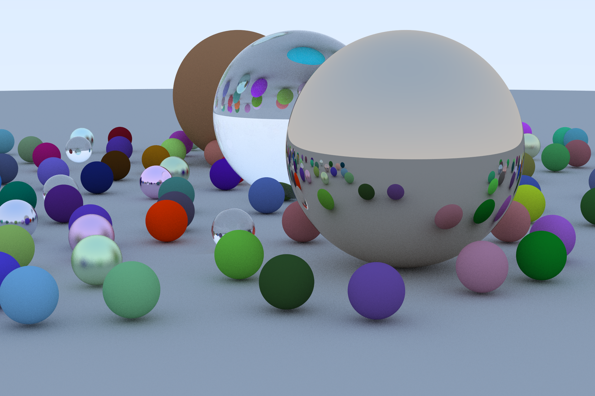

# Raytracing in One Weekend

A full implementation of the Raytracer described in [Ray Tracing in One Weekend](https://raytracing.github.io/) by [Peter Shirley](https://twitter.com/Peter_shirley).

Each pixel is created as a future and then rendered.

License MIT
